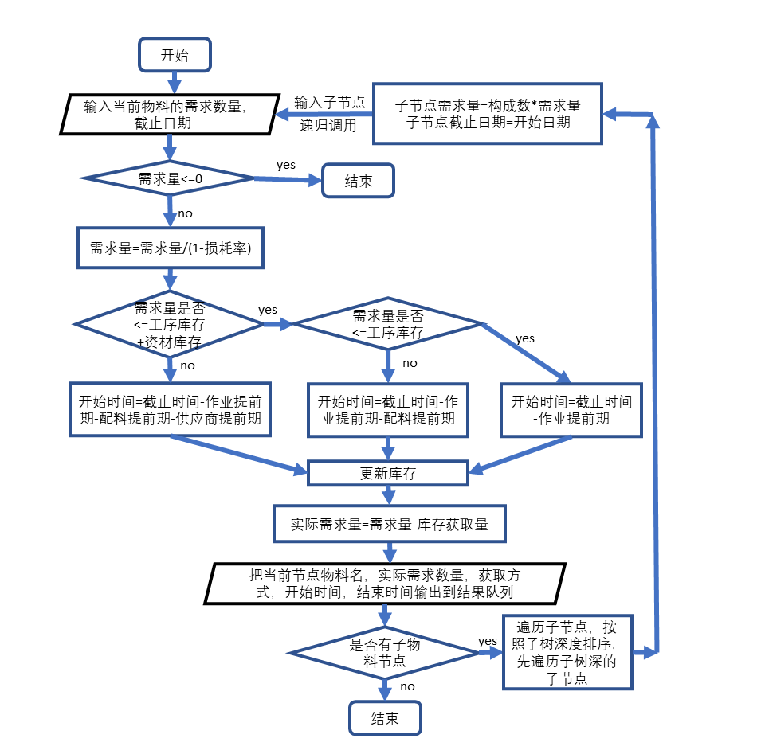
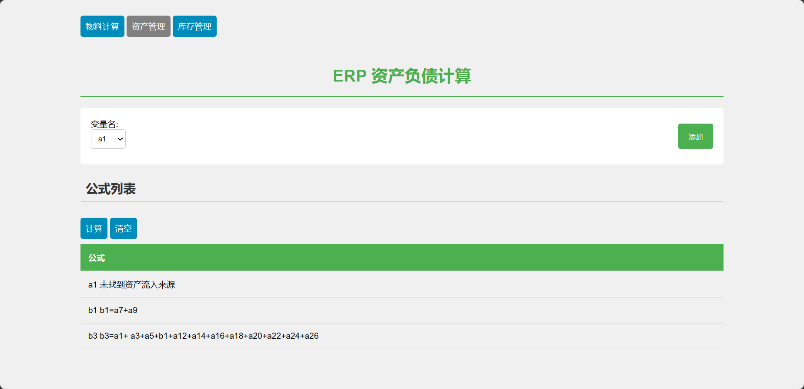
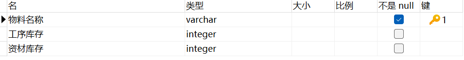

# simple-erp-system

✨ **基于 Python, FastAPI, sqlite3 的简单 ERP 系统**：企业资源计划系统（Enterprise Resource Planning System），实现 MPS(Master Production Schedule) 的计算，按时间分段计划企业应生产的最终产品的数量和交货期；资产负债表公式查询。

[个人网站：www.bytesc.top](http://www.bytesc.top) 包含项目 📌 [在线演示](http://www.bytesc.top#erp)  📌 

[个人博客：blog.bytesc.top](http://blog.bytesc.top)

🔔 如有项目相关问题，欢迎在本项目提出`issue`，我一般会在 24 小时内回复。

🚩 欢迎参考、复用代码，但请遵守`LICENSE`文件中的开源协议（参考翻译见本文档末尾）。对本仓库内的实质性内容（包括但不限于数据，图片，文档）保留著作权。

## 功能介绍

- 根据 MPS(Master Production Schedule) 按时间分段计划企业应生产的最终产品的数量和交货期
- 实现资产负债表公式查询
- 注释详细，易复现
- 极简的项目架构
- 极简的页面布局，轻量化的前端代码

## 功能优点
- **根据库存动态更新计划日期**：根据工序库存和资材库存的余量，判断是否需要配料提前期和供应商提前期，根据库存更新计划日期。
- **不会处理不需要的子节点**：当某个节点库存够用，实际需求量（要生产/采购的数量）为 0 时，不会处理其子节点。
- **底层的物料先分配库存，得到最优方案**：搜索时按照子树深度对子节点排序，优先遍历子树深度较大的子节点，尽可能让底层的物料先拿到库存。

## 基本原理

🚩 系统架构：


🚩 DPS 算法流程：



- 通过读取数据库中的物料的子父关系表，建立物料合成关系树，并用 DFS(Deep First Search) 深度优先搜索算法遍历物料关系树，并标记节点深度和每个节点的子树深度。
- 按照 MPS 队列和物料库存数量，深度优先搜索，计算生产和采购计划。
    * 根据工序库存和资材库存，判断是否需要配料提前期和供应商提前期，动态更新计划日期。
    * 按照子树深度对子节点排序，优先遍历子树深的子节点，尽可能让底层的物料先分配库存。
    * 当实际需求量（要生产/采购的数量）为 0 时返回，防止生产/采购无需处理的子节点。

## 功能展示

添加 MPS 记录

产品名称从数据库中获取，用户可选择

点击计算，可一次性计算多条计划，按照时间优先级分配库存

资产负债公式变量同意从数据库中获取

可以一输出计算多个变量的公式

可手动修改库存信息（点击计算也会根据消耗自动更新库存）


## 数据库结构

`erpdata.db` 为 sqlite3 数据文件，`sql` 文件夹下包含数据库备份sql代码。

数据库结构


`supply`物料信息表


`inventory`物料构成清单


`store`库存表



`bom`资产负债信息表


## 项目运行

环境`python 3.9`

安装依赖
```bash
pip install -r requirements.txt
```
运行
```bash
python erpsys.py
```
浏览器访问 [http://127.0.0.1:8080](http://127.0.0.1:8080)即可进入系统

如果8080端口被占用，修改`erpsys.py`文件末尾的端口配置 (port) 即可。
```python
if __name__ == "__main__":
    import uvicorn
    uvicorn.run(app, host="127.0.0.1", port=8081) 
```
注意，如果这里 `host="0.0.0.0"` 代表允许所有host访问，请依然浏览器输入 [http://127.0.0.1:8080](http://127.0.0.1:8080) 而不是 [http://0.0.0.0:8080](http://0.0.0.0:8080) 

## 项目结构

```txt
│  connectdb.py
├─ERP
│      ERP.py
│      MPS.py
│      Tree.py
├─templates
│      func.html
│      index.html
├─readme_img
├─sql
│      structure_data.sql
│      structure_only.sql
│  erpdata.db
│  erpsys.py
│  LICENSE
│  README.md
│  requirements.txt
```

- `erpsys.py` 是源代码文件，包含服务端代码，也是项目的运行入口
- `ERP` 文件夹下存放源代码文件，包含核心算法代码
- `connectdb.py` 包含数据库配置，连接，查询程序
- `erpdata.db` sqlite3 数据库文件
- `templates` 文件夹存放待渲染的 html 模板文件
- `sql` 文件夹存放创建数据库的 sql 代码


# 开源许可证

此翻译版本仅供参考，以 LICENSE 文件中的英文版本为准

MIT 开源许可证：

版权所有 (c) 2023 bytesc

特此授权，免费向任何获得本软件及相关文档文件（以下简称“软件”）副本的人提供使用、复制、修改、合并、出版、发行、再许可和/或销售软件的权利，但须遵守以下条件：

上述版权声明和本许可声明应包含在所有副本或实质性部分中。

本软件按“原样”提供，不作任何明示或暗示的保证，包括但不限于适销性、特定用途适用性和非侵权性。在任何情况下，作者或版权持有人均不对因使用本软件而产生的任何索赔、损害或其他责任负责，无论是在合同、侵权或其他方面。